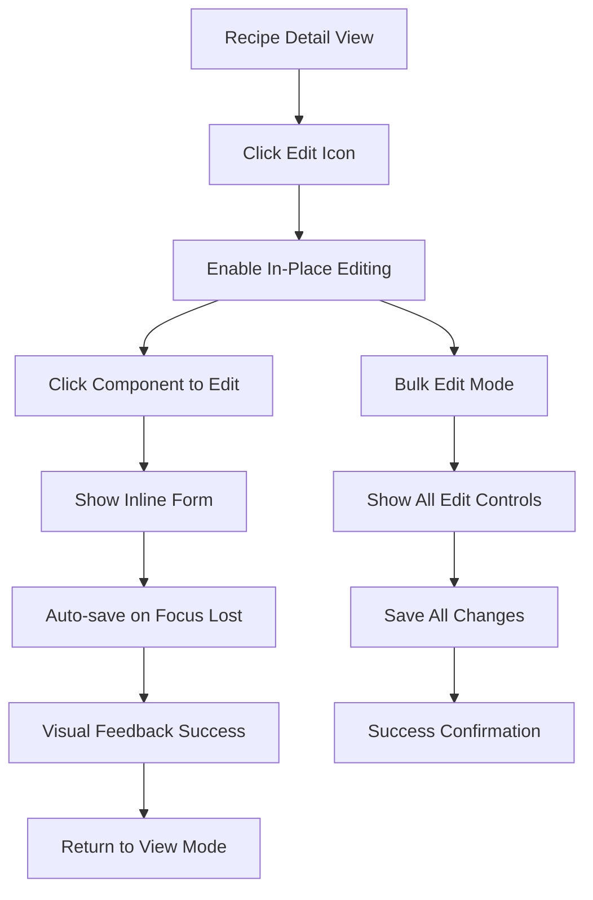
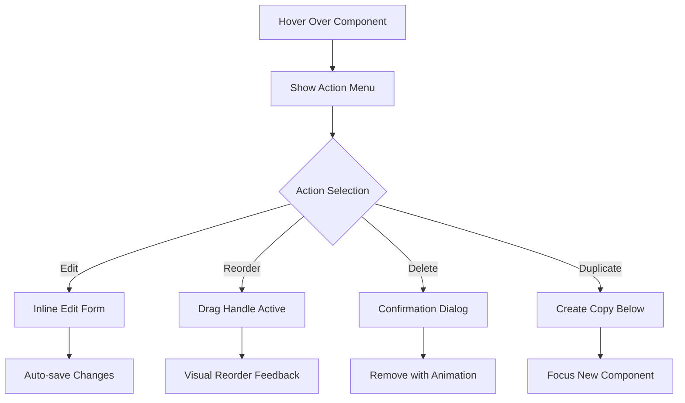
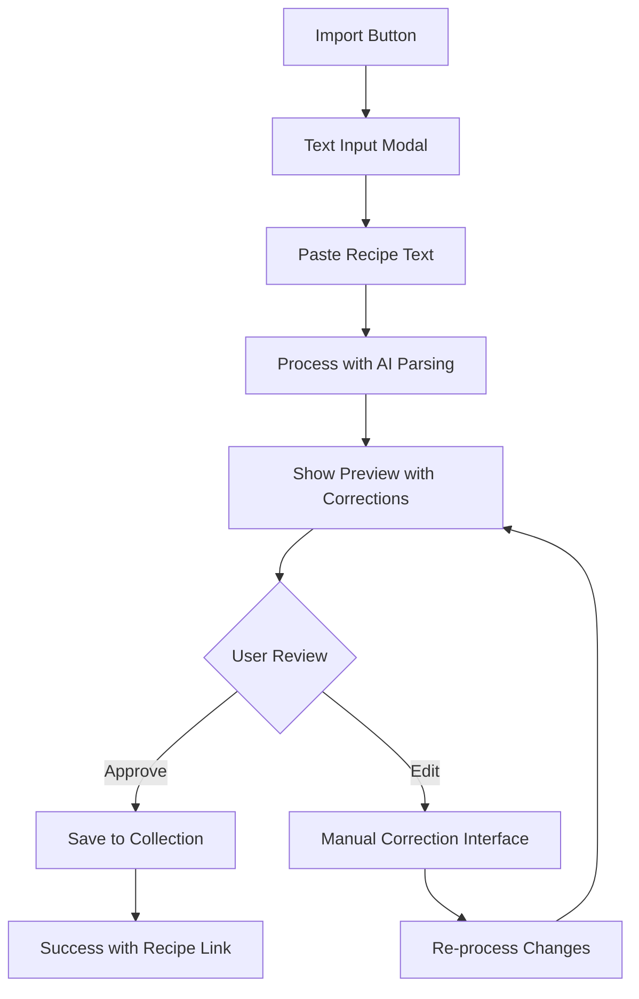

# Recipe CRUD UI/UX Design Specifications - Phase 2 Completion

**Project:** Tastebase - Local-First Personal Recipe Management  
**Phase:** Phase 2 Recipe CRUD Operations (Remaining Tasks)  
**Date:** 2025-01-06  
**Focus:** Mobile-First Responsive Design with ShadCN Components  

## Executive Summary

This document provides comprehensive UX/UI design specifications for completing the remaining Phase 2 Recipe CRUD tasks in Tastebase. The design focuses on intuitive recipe management workflows with emphasis on mobile-first responsive design, in-place editing capabilities, efficient image management, and seamless recipe import experiences.

**Key Design Principles:**
- **Bold Simplicity**: Reduce cognitive load with clear visual hierarchies and focused interactions
- **Mobile-First**: Touch-friendly interfaces that scale up to desktop experiences
- **Progressive Disclosure**: Hide complexity behind discoverable, contextual interactions
- **Immediate Feedback**: Real-time validation, loading states, and success confirmations
- **Data Preservation**: Auto-save functionality and clear unsaved change indicators

---

## 1. User Experience Analysis & Requirements

### Primary User Personas

#### The Passionate Home Cook
- **Needs**: Quick recipe editing, efficient ingredient management, visual recipe organization
- **Pain Points**: Tedious form filling, losing unsaved changes, difficult mobile editing
- **Mental Model**: Expects cookbook-like experience with modern digital conveniences

#### The Recipe Collector
- **Needs**: Easy recipe import, bulk image management, searchable recipe library
- **Pain Points**: Manual data entry, inconsistent import results, cluttered interfaces
- **Mental Model**: Expects database-like organization with visual browsing capabilities

### User Journey Analysis

#### Recipe Editing Flow
1. **Entry Point**: Recipe detail view → Edit action
2. **Context Switching**: In-place editing vs. form-based editing decisions
3. **Component Management**: Adding/removing/reordering ingredients and instructions
4. **Image Management**: Upload, replace, organize recipe photos
5. **Validation & Save**: Real-time feedback with clear success/error states

#### Recipe Import Flow
1. **Text Input**: Paste or type recipe from external sources
2. **AI Processing**: Parse ingredients, instructions, metadata (future AI integration ready)
3. **Manual Correction**: Review and fix parsing errors
4. **Finalization**: Save to personal recipe collection

---

## 2. Design Philosophy & Approach

### Bold Simplicity Guidelines

**Visual Hierarchy:**
- Use ShadCN semantic colors for consistent theming
- Primary actions in `primary` color, secondary in `secondary`
- Status indicators with `chart-1` through `chart-5` for variety
- Destructive actions clearly marked with `destructive` color

**Interaction Patterns:**
- Touch targets minimum 44px on mobile
- Hover states for desktop with `/10` and `/20` opacity modifiers
- Loading states with skeleton components for all dynamic content
- Clear affordances for drag-and-drop reordering

**Cognitive Load Reduction:**
- Progressive disclosure: advanced features hidden behind "More options"
- Contextual help with tooltip integration
- Smart defaults based on existing recipe patterns
- Bulk actions available but not prominent

---

## 3. Visual Design System & ShadCN Color Integration

### Primary Interface Colors

```css
/* Hero sections and main areas */
.hero-gradient {
  background: bg-gradient-to-br from-accent/20 via-background to-primary/10;
}

/* Interactive elements */
.primary-action {
  background: bg-gradient-to-r from-primary to-chart-1;
  hover: hover:from-primary/90;
}

/* Recipe status indicators */
.status-success { color: text-chart-2; }      /* Green for completed/saved */
.status-warning { color: text-chart-3; }      /* Yellow for unsaved changes */
.status-error { color: text-destructive; }    /* Red for validation errors */
.status-info { color: text-chart-1; }         /* Blue for general info */
.status-feature { color: text-chart-4; }      /* Purple for special features */
```

### Component Color Specifications

**Form Elements:**
- Input fields: `border-input` with `focus:border-chart-1` focus states
- Select dropdowns: `bg-background` with `hover:bg-accent/10` hover states
- Buttons: Primary `bg-primary`, Secondary `bg-secondary`, Outline `border-border`

**Recipe Components:**
- Ingredient cards: `bg-card` with `hover:bg-accent/5` hover states
- Instruction steps: `border-l-chart-2` for step indicators
- Tags: `bg-chart-5/20` with `text-chart-5` for recipe categories

**Status and Feedback:**
- Success states: `bg-chart-2/10` backgrounds with `text-chart-2` text
- Warning states: `bg-chart-3/10` backgrounds with `text-chart-3` text
- Error states: `bg-destructive/10` backgrounds with `text-destructive` text

---

## 4. User Flow & Interaction Design

### Recipe Editing User Flow

#### In-Place Editing Mode


#### Component-Level Actions Flow


### Recipe Import User Flow

#### Text Import Processing


### Micro-Interactions and Animations

**Component State Transitions:**
- Edit mode toggle: 200ms ease-in-out with subtle scale (1.02x)
- Save success: Green checkmark animation with bounce effect
- Error states: Red shake animation (3px left-right, 150ms)
- Loading states: Skeleton fade-in with shimmer effect

**Drag and Drop Feedback:**
- Drag start: Component lifts with shadow and 5° rotation
- Drop zones: Highlight with dashed border and `bg-primary/10`
- Reorder complete: Smooth slide animation to final position

---

## 5. Interface Layout & Component Specifications

### Recipe Edit Form Layout

#### Mobile-First Component Structure (320px+)
```tsx
<div className="space-y-6 px-4 pb-20"> {/* Bottom padding for floating actions */}
  <RecipeHeader 
    title="Edit Recipe"
    showBackButton
    showActions={false}
    className="sticky top-0 z-10 bg-background/95"
  />
  
  <Card className="border-0 shadow-sm">
    <CardContent className="p-4 space-y-4">
      <InlineTitleEdit />
      <InlineDescriptionEdit />
      <BasicMetadataGrid />
    </CardContent>
  </Card>
  
  <IngredientsSection />
  <InstructionsSection />
  <ImagesSection />
  <TagsSection />
  
  {/* Floating Action Bar */}
  <FloatingActionBar 
    actions={['cancel', 'save']}
    className="fixed bottom-4 left-4 right-4 z-20"
  />
</div>
```

#### Desktop Layout (1024px+)
```tsx
<div className="grid grid-cols-12 gap-6 max-w-7xl mx-auto px-6">
  <div className="col-span-8 space-y-6">
    <RecipeEditForm />
  </div>
  
  <div className="col-span-4 space-y-4 sticky top-6 h-fit">
    <RecipePreviewCard />
    <RecentChangesCard />
    <QuickActionsCard />
  </div>
</div>
```

### In-Place Editing Components

#### Inline Text Editor
```tsx
interface InlineTextEditProps {
  value: string;
  onSave: (value: string) => Promise<void>;
  placeholder?: string;
  multiline?: boolean;
  validation?: (value: string) => string | undefined;
  className?: string;
}

// Visual states:
// - View: hover:bg-accent/5 with edit icon on hover
// - Edit: focus:ring-2 focus:ring-chart-1 with auto-resize
// - Saving: opacity-50 with spinner overlay
// - Success: brief green highlight fade-out
// - Error: border-destructive with error message below
```

#### Ingredient Component Manager
```tsx
<Card className="group hover:shadow-md transition-shadow">
  <CardContent className="p-3">
    <div className="flex items-start gap-3">
      <DragHandle className="opacity-0 group-hover:opacity-100" />
      
      <div className="flex-1 grid grid-cols-1 sm:grid-cols-4 gap-2">
        <InlineEdit field="name" />
        <InlineEdit field="amount" type="number" />
        <InlineEdit field="unit" />
        <InlineEdit field="notes" placeholder="Optional notes" />
      </div>
      
      <ActionMenu 
        actions={['edit', 'duplicate', 'delete']}
        className="opacity-0 group-hover:opacity-100"
      />
    </div>
  </CardContent>
</Card>
```

### Image Management Interface

#### Image Upload and Gallery
```tsx
<Card>
  <CardHeader>
    <CardTitle className="flex items-center justify-between">
      Recipe Images
      <Button variant="outline" size="sm">
        <Upload className="h-4 w-4 mr-2" />
        Add Images
      </Button>
    </CardTitle>
  </CardHeader>
  
  <CardContent>
    <ImageUploadDropzone 
      onUpload={handleImageUpload}
      maxFiles={10}
      acceptedTypes={['image/jpeg', 'image/png', 'image/webp']}
      className="border-2 border-dashed border-muted-foreground/25 hover:border-chart-1/50"
    />
    
    <div className="grid grid-cols-2 md:grid-cols-3 lg:grid-cols-4 gap-3 mt-4">
      {images.map((image, index) => (
        <ImageCard 
          key={image.id}
          image={image}
          isHero={index === 0}
          onSetHero={() => setHeroImage(image.id)}
          onDelete={() => deleteImage(image.id)}
          onEdit={() => editImageMetadata(image.id)}
          className="aspect-square"
        />
      ))}
    </div>
  </CardContent>
</Card>
```

#### Image Card Component
```tsx
<div className="relative group rounded-lg overflow-hidden bg-muted">
  
  
  {isHero && (
    <Badge className="absolute top-2 left-2 bg-chart-1">
      Hero Image
    </Badge>
  )}
  
  <div className="absolute inset-0 bg-black/0 group-hover:bg-black/50 transition-colors">
    <div className="absolute inset-0 opacity-0 group-hover:opacity-100 flex items-center justify-center gap-2">
      <Button size="sm" variant="secondary">
        <Star className="h-4 w-4" />
      </Button>
      <Button size="sm" variant="secondary">
        <Edit className="h-4 w-4" />
      </Button>
      <Button size="sm" variant="destructive">
        <Trash className="h-4 w-4" />
      </Button>
    </div>
  </div>
</div>
```

---

## 6. Recipe Import Interface Design

### Text Import Modal

#### Import Process Flow
```tsx
<Dialog open={isImportOpen} onOpenChange={setIsImportOpen}>
  <DialogContent className="max-w-4xl max-h-[90vh] flex flex-col">
    <DialogHeader>
      <DialogTitle>Import Recipe from Text</DialogTitle>
      <DialogDescription>
        Paste your recipe text below and we'll help organize it for you
      </DialogDescription>
    </DialogHeader>
    
    <div className="flex-1 overflow-hidden">
      {currentStep === 'input' && <TextInputStep />}
      {currentStep === 'processing' && <ProcessingStep />}
      {currentStep === 'review' && <ReviewStep />}
      {currentStep === 'success' && <SuccessStep />}
    </div>
    
    <DialogFooter className="border-t pt-4">
      <StepNavigation />
    </DialogFooter>
  </DialogContent>
</Dialog>
```

#### Text Input Interface
```tsx
<div className="space-y-4">
  <div className="grid grid-cols-1 lg:grid-cols-2 gap-4 h-96">
    <div className="space-y-2">
      <Label>Recipe Text</Label>
      <Textarea
        value={recipeText}
        onChange={setRecipeText}
        placeholder="Paste your recipe here..."
        className="h-full resize-none"
      />
    </div>
    
    <div className="space-y-2">
      <Label>Live Preview</Label>
      <div className="border rounded-md h-full overflow-y-auto p-3 bg-muted/50">
        <RecipePreview text={recipeText} />
      </div>
    </div>
  </div>
  
  <div className="flex items-center gap-4">
    <Button 
      onClick={processRecipe}
      disabled={!recipeText.trim()}
      className="bg-gradient-to-r from-primary to-chart-1"
    >
      Process Recipe
      <ArrowRight className="h-4 w-4 ml-2" />
    </Button>
    
    <div className="text-sm text-muted-foreground">
      We support most recipe formats including ingredient lists and step-by-step instructions
    </div>
  </div>
</div>
```

#### Review and Correction Interface
```tsx
<div className="grid grid-cols-1 lg:grid-cols-2 gap-6 h-full">
  <div className="space-y-4">
    <h3 className="font-semibold">Parsed Recipe</h3>
    
    <Card>
      <CardHeader>
        <CardTitle className="text-sm">Basic Information</CardTitle>
      </CardHeader>
      <CardContent className="space-y-3">
        <InlineEdit field="title" value={parsedRecipe.title} />
        <InlineEdit field="description" value={parsedRecipe.description} multiline />
        <div className="grid grid-cols-3 gap-2">
          <InlineEdit field="servings" value={parsedRecipe.servings} type="number" />
          <InlineEdit field="prepTime" value={parsedRecipe.prepTime} type="number" />
          <InlineEdit field="cookTime" value={parsedRecipe.cookTime} type="number" />
        </div>
      </CardContent>
    </Card>
    
    <EditableIngredientsList ingredients={parsedRecipe.ingredients} />
    <EditableInstructionsList instructions={parsedRecipe.instructions} />
  </div>
  
  <div className="space-y-4">
    <h3 className="font-semibold">Original Text</h3>
    <div className="border rounded-md h-full overflow-y-auto p-3 bg-muted/50 text-sm">
      <pre className="whitespace-pre-wrap font-mono">{originalText}</pre>
    </div>
  </div>
</div>
```

---

## 7. Advanced Search & Filtering Interface

### Enhanced Recipe Search

#### Search Header Integration
```tsx
<RecipeHeader
  title="My Recipes"
  subtitle={`${totalRecipes} recipes in your collection`}
  showSearch
  showViewToggle
  showFilters
  showActions
  onSearch={handleSearch}
  searchPlaceholder="Search recipes, ingredients, or instructions..."
/>
```

#### Advanced Filter Panel
```tsx
<Card className="mb-6">
  <CardHeader className="pb-3">
    <div className="flex items-center justify-between">
      <CardTitle className="text-base">Filters</CardTitle>
      <Button 
        variant="ghost" 
        size="sm" 
        onClick={toggleFilters}
        className="h-auto p-0"
      >
        {showFilters ? (
          <>
            <ChevronUp className="h-4 w-4 mr-1" />
            Less
          </>
        ) : (
          <>
            <ChevronDown className="h-4 w-4 mr-1" />
            More Filters
          </>
        )}
      </Button>
    </div>
  </CardHeader>
  
  {showFilters && (
    <CardContent className="pt-0 space-y-4">
      <div className="grid grid-cols-1 sm:grid-cols-2 lg:grid-cols-4 gap-3">
        <MultiSelect
          label="Difficulty"
          options={difficultyOptions}
          value={filters.difficulty}
          onChange={(value) => setFilters({...filters, difficulty: value})}
        />
        
        <MultiSelect
          label="Cuisine"
          options={cuisineOptions}
          value={filters.cuisine}
          onChange={(value) => setFilters({...filters, cuisine: value})}
        />
        
        <TimeRangeFilter
          label="Prep Time"
          value={filters.prepTime}
          onChange={(value) => setFilters({...filters, prepTime: value})}
        />
        
        <TimeRangeFilter
          label="Cook Time"
          value={filters.cookTime}
          onChange={(value) => setFilters({...filters, cookTime: value})}
        />
      </div>
      
      <div className="flex items-center gap-2">
        <TagFilter
          selectedTags={filters.tags}
          onTagsChange={(tags) => setFilters({...filters, tags})}
        />
      </div>
      
      <div className="flex justify-between items-center pt-2 border-t">
        <Badge variant="secondary" className="text-xs">
          {filteredCount} recipes match your filters
        </Badge>
        
        <Button 
          variant="outline" 
          size="sm"
          onClick={clearFilters}
          disabled={!hasActiveFilters}
        >
          Clear All
        </Button>
      </div>
    </CardContent>
  )}
</Card>
```

#### Smart Search Suggestions
```tsx
<div className="relative">
  <div className="absolute left-3 top-1/2 transform -translate-y-1/2">
    <Search className="h-4 w-4 text-muted-foreground" />
  </div>
  
  <Input
    value={searchQuery}
    onChange={handleSearchChange}
    placeholder="Search recipes, ingredients, or instructions..."
    className="pl-9 pr-4"
  />
  
  {searchSuggestions.length > 0 && (
    <Card className="absolute top-full mt-1 w-full z-10 shadow-lg">
      <CardContent className="p-0">
        <div className="max-h-64 overflow-y-auto">
          {searchSuggestions.map((suggestion, index) => (
            <button
              key={suggestion.id}
              onClick={() => selectSuggestion(suggestion)}
              className="w-full p-3 text-left hover:bg-accent/50 flex items-center gap-3 border-b last:border-b-0"
            >
              <Badge variant="outline" className="text-xs">
                {suggestion.type}
              </Badge>
              <span className="flex-1">{suggestion.text}</span>
              <span className="text-xs text-muted-foreground">
                {suggestion.count} recipes
              </span>
            </button>
          ))}
        </div>
      </CardContent>
    </Card>
  )}
</div>
```

---

## 8. Component State Management & Validation

### Form State Architecture

#### Real-Time Validation System
```tsx
interface FormFieldState {
  value: string | number | boolean;
  error?: string;
  isDirty: boolean;
  isValidating: boolean;
  lastValidated?: Date;
}

interface RecipeFormState {
  fields: Record<string, FormFieldState>;
  hasUnsavedChanges: boolean;
  autoSaveEnabled: boolean;
  lastSaved?: Date;
  saveInProgress: boolean;
}
```

#### Validation Feedback Patterns
```css
/* Success validation */
.field-success {
  @apply border-chart-2 focus:border-chart-2;
}
.field-success::after {
  content: "✓";
  @apply absolute right-3 top-1/2 -translate-y-1/2 text-chart-2;
}

/* Error validation */
.field-error {
  @apply border-destructive focus:border-destructive;
}
.field-error-message {
  @apply text-sm text-destructive mt-1 flex items-center gap-1;
}

/* Warning validation */
.field-warning {
  @apply border-chart-3 focus:border-chart-3;
}
```

### Auto-Save Implementation

#### Save State Indicators
```tsx
<div className="flex items-center gap-2 text-sm text-muted-foreground">
  {saveState === 'saving' && (
    <>
      <Loader className="h-3 w-3 animate-spin" />
      <span>Saving...</span>
    </>
  )}
  
  {saveState === 'saved' && (
    <>
      <Check className="h-3 w-3 text-chart-2" />
      <span>All changes saved</span>
    </>
  )}
  
  {saveState === 'error' && (
    <>
      <AlertTriangle className="h-3 w-3 text-destructive" />
      <span>Save failed - changes stored locally</span>
    </>
  )}
  
  {saveState === 'dirty' && (
    <>
      <Clock className="h-3 w-3 text-chart-3" />
      <span>Unsaved changes</span>
    </>
  )}
</div>
```

---

## 9. Mobile Responsiveness Specifications

### Touch Interface Optimizations

#### Mobile-First Form Design
```tsx
// Mobile: Stack form fields vertically
<div className="space-y-4">
  <FormField>
    <Label className="text-base"> {/* Larger labels for touch */}
      Recipe Title
    </Label>
    <Input 
      className="h-12 text-base" // Minimum 44px touch target
      placeholder="Enter recipe title"
    />
  </FormField>
</div>

// Tablet+: Grid layout for efficiency
<div className="grid grid-cols-1 md:grid-cols-2 lg:grid-cols-3 gap-4">
  {/* Form fields in grid */}
</div>
```

#### Mobile Navigation Patterns
```tsx
<Sheet open={mobileMenuOpen} onOpenChange={setMobileMenuOpen}>
  <SheetTrigger asChild>
    <Button 
      variant="ghost" 
      size="icon" 
      className="lg:hidden"
      aria-label="Open recipe actions menu"
    >
      <MoreVertical className="h-5 w-5" />
    </Button>
  </SheetTrigger>
  
  <SheetContent side="right" className="w-80">
    <SheetHeader>
      <SheetTitle>Recipe Actions</SheetTitle>
    </SheetHeader>
    
    <div className="space-y-2 mt-4">
      <Button variant="ghost" className="w-full justify-start h-12">
        <Edit className="h-4 w-4 mr-3" />
        Edit Recipe
      </Button>
      <Button variant="ghost" className="w-full justify-start h-12">
        <Share className="h-4 w-4 mr-3" />
        Share Recipe
      </Button>
      <Button variant="ghost" className="w-full justify-start h-12">
        <Copy className="h-4 w-4 mr-3" />
        Duplicate Recipe
      </Button>
    </div>
  </SheetContent>
</Sheet>
```

### Responsive Grid Patterns

#### Recipe Card Responsive Layout
```css
/* Mobile: Single column */
.recipe-grid {
  @apply grid grid-cols-1 gap-4;
}

/* Small tablet: 2 columns */
@media (min-width: 640px) {
  .recipe-grid {
    @apply grid-cols-2 gap-4;
  }
}

/* Large tablet: 3 columns */
@media (min-width: 1024px) {
  .recipe-grid {
    @apply grid-cols-3 gap-6;
  }
}

/* Desktop: 4 columns */
@media (min-width: 1280px) {
  .recipe-grid {
    @apply grid-cols-4 gap-6;
  }
}
```

---

## 10. Loading States & Skeleton Components

### Comprehensive Skeleton System

#### Recipe Edit Form Skeleton
```tsx
export function RecipeEditFormSkeleton() {
  return (
    <div className="space-y-6">
      {/* Header skeleton */}
      <div className="space-y-2">
        <Skeleton className="h-8 w-48" />
        <Skeleton className="h-4 w-64" />
      </div>
      
      {/* Basic info card skeleton */}
      <Card>
        <CardHeader>
          <Skeleton className="h-6 w-32" />
        </CardHeader>
        <CardContent className="space-y-4">
          <Skeleton className="h-10 w-full" />
          <Skeleton className="h-20 w-full" />
          
          <div className="grid grid-cols-1 md:grid-cols-3 gap-4">
            {[0, 1, 2].map((index) => (
              <Skeleton key={`metadata-${index + 1}`} className="h-10 w-full" />
            ))}
          </div>
        </CardContent>
      </Card>
      
      {/* Ingredients section skeleton */}
      <Card>
        <CardHeader>
          <Skeleton className="h-6 w-24" />
        </CardHeader>
        <CardContent className="space-y-3">
          {[0, 1, 2, 3].map((index) => (
            <div key={`ingredient-${index + 1}`} className="grid grid-cols-4 gap-2">
              <Skeleton className="h-10 w-full" />
              <Skeleton className="h-10 w-full" />
              <Skeleton className="h-10 w-full" />
              <Skeleton className="h-10 w-full" />
            </div>
          ))}
        </CardContent>
      </Card>
    </div>
  );
}
```

#### Image Management Skeleton
```tsx
export function ImageGallerySkeleton({ count = 6 }: { count?: number }) {
  return (
    <div className="grid grid-cols-2 md:grid-cols-3 lg:grid-cols-4 gap-3">
      {Array.from({ length: count }, (_, i) => (
        <div key={`image-skeleton-${i + 1}`} className="aspect-square relative">
          <Skeleton className="w-full h-full rounded-lg" />
          
          {/* Hero badge skeleton for first image */}
          {i === 0 && (
            <div className="absolute top-2 left-2">
              <Skeleton className="h-5 w-16 rounded-full" />
            </div>
          )}
          
          {/* Action buttons skeleton */}
          <div className="absolute inset-0 flex items-center justify-center gap-2 opacity-0">
            <Skeleton className="h-8 w-8 rounded" />
            <Skeleton className="h-8 w-8 rounded" />
            <Skeleton className="h-8 w-8 rounded" />
          </div>
        </div>
      ))}
    </div>
  );
}
```

---

## 11. Accessibility & Performance Considerations

### WCAG 2.1 AA Compliance

#### Color Contrast Requirements
```css
/* All ShadCN colors meet WCAG AA requirements by default */
/* Additional high-contrast mode support */
@media (prefers-contrast: high) {
  .high-contrast-text {
    @apply text-foreground;
    filter: contrast(1.2);
  }
  
  .high-contrast-border {
    @apply border-foreground;
  }
}
```

#### Keyboard Navigation Support
```tsx
// Enhanced keyboard navigation for drag-and-drop
<div
  tabIndex={0}
  role="button"
  aria-label={`Ingredient ${index + 1}: ${ingredient.name}. Press Enter to edit, Arrow keys to reorder`}
  onKeyDown={handleIngredientKeyDown}
  className="focus:outline-none focus:ring-2 focus:ring-chart-1 rounded"
>
  {/* Ingredient content */}
</div>

// Screen reader announcements for dynamic actions
<div aria-live="polite" className="sr-only">
  {saveStatus === 'saving' && 'Saving recipe changes'}
  {saveStatus === 'saved' && 'Recipe changes saved successfully'}
  {saveStatus === 'error' && 'Failed to save recipe changes'}
</div>
```

#### Alternative Text and Labels
```tsx


<Button aria-label={`Delete ${ingredient.name} ingredient`}>
  <Trash className="h-4 w-4" />
</Button>
```

### Performance Optimizations

#### Image Loading Strategy
```tsx
// Progressive image loading with blur placeholders
<div className="relative overflow-hidden">
  {/* Blur placeholder */}
  <div 
    className="absolute inset-0 bg-gradient-to-br from-muted to-muted/50 animate-pulse"
    style={{ 
      backgroundImage: `url("data:image/svg+xml,%3Csvg...")` 
    }} 
  />
  
  {/* Optimized image */}
   setImageLoaded(true)}
    className={`w-full h-full object-cover transition-opacity duration-300 ${
      imageLoaded ? 'opacity-100' : 'opacity-0'
    }`}
  />
</div>
```

#### Virtual Scrolling for Large Lists
```tsx
// For recipe lists with 100+ items
import { FixedSizeList as List } from 'react-window';

<List
  height={600}
  itemCount={recipes.length}
  itemSize={120}
  itemData={recipes}
  className="w-full"
>
  {({ index, style, data }) => (
    <div style={style}>
      <RecipeCard recipe={data[index]} />
    </div>
  )}
</List>
```

---

## Implementation Roadmap

### Phase 2A: Enhanced Recipe Editing (3-4 days)
1. **Component Actions Infrastructure**
   - Implement ingredient/instruction CRUD server actions
   - Create reusable inline editing components
   - Build drag-and-drop reordering system

2. **In-Place Editing Interface**
   - Design and implement inline text editors
   - Create auto-save functionality with conflict resolution
   - Build real-time validation system

3. **Mobile-Responsive Forms**
   - Optimize forms for touch interfaces
   - Implement floating action bars for mobile
   - Create responsive grid layouts

### Phase 2B: Image Management System (2-3 days)
1. **Image Upload Infrastructure**
   - Implement multi-file drag-and-drop upload
   - Create image processing pipeline (resize, optimize)
   - Build image metadata management system

2. **Gallery Management Interface**
   - Design image gallery with reordering
   - Implement hero image selection
   - Create image editing modal (crop, alt text)

### Phase 2C: Advanced Search & Import (2-3 days)
1. **Enhanced Search Interface**
   - Build advanced filtering system
   - Implement search suggestions and autocomplete
   - Create faceted search with real-time results

2. **Recipe Import System**
   - Design text import interface
   - Implement parsing and correction workflow
   - Create import preview and review system

### Phase 2D: Polish & Integration (1-2 days)
1. **Performance Optimization**
   - Implement skeleton loading states
   - Optimize image loading and caching
   - Add virtual scrolling for large datasets

2. **Accessibility & Testing**
   - Ensure WCAG 2.1 AA compliance
   - Test keyboard navigation workflows
   - Validate screen reader compatibility

---

## Technical Implementation Notes

### Required ShadCN Components
Ensure these components are installed before implementation:
```bash
npx shadcn@latest add alert-dialog
npx shadcn@latest add dropdown-menu
npx shadcn@latest add sheet
npx shadcn@latest add tooltip
npx shadcn@latest add progress
npx shadcn@latest add slider
npx shadcn@latest add tabs
npx shadcn@latest add toggle
```

### Server Action Extensions Needed
Based on Phase 2 plan analysis, implement these missing actions:
- `addRecipeIngredient`, `updateRecipeIngredient`, `removeRecipeIngredient`
- `addRecipeInstruction`, `updateRecipeInstruction`, `removeRecipeInstruction`
- `uploadRecipeImage`, `setRecipeHeroImage`, `deleteRecipeImage`
- Recipe component reordering actions

### Component Organization
Follow established patterns:
- Forms: `/src/components/forms/recipe-edit-form.tsx`
- Lists: `/src/components/lists/ingredient-manager.tsx`
- Cards: `/src/components/cards/image-gallery-card.tsx`
- Modals: `/src/components/modals/recipe-import-modal.tsx`
- Skeletons: `/src/components/skeletons/recipe-edit-skeleton.tsx`

This comprehensive design specification provides the foundation for completing Phase 2 Recipe CRUD operations with a focus on intuitive user experiences, mobile-first design, and seamless integration with the existing Tastebase architecture.